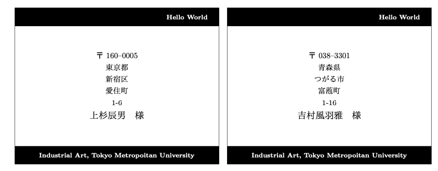

# csv2TexLetterLabel
CSVファイルに保存された住所録から宛名ラベルをTeX形式で自動生成します。当学科の出力フォーマット依存です。
 
# 出力サンプル
表示されている住所は疑似生成された架空のデータです。
  * [PDF出力サンプル](label.pdf)



# Features
このプロジェクトで幸せになる人
  * 大量の住所録から一括で印刷用宛名ラベルを作成しなければならない人
  * pythonを少しかじってて、ワードやエクセルを使った宛名印刷が毎回面倒だと日夜思っている人

本リポジトリは作者が大学職場内業務で必要にかられて開発したものです。きっと誰かがこれで幸せになれることを願って公開しております。
 
# Requirement
* python(>3.6)
* TeX環境（ローカルでTeXコンパイルを行う場合のみ）
* 印刷機（差し込み印刷で封筒に直接印刷してもOK）
* [ラベル印刷用シール](https://www.kaunet.com/rakuraku/variation/00005161/?LID=0&Keyword=%83%89%83x%83%8B%97p%8E%86%81%40A4%81%40%83m%81%5B%83J%83b%83g&mainImg=K3308084.jpg)（シールで宛名を貼る場合）
* カッター
* カッターマット

# Usage
プロジェクトをクローンして、住所録のcsvファイル形式に合わせてpythonコードを修正して、実行。label.texというファイルが生成されるので、platexでコンパイルしてpdfにする。という流れです。
```bash
git clone https://github.com/TetsuakiBaba/csv2TexLetterLabel
cd csv2TexLetterLabel
python3 csv2TexLetterLabel.py
platex label; dvipdfmx label
```
ローカルにTeX環境がない場合は下記OverleafのExampleをご利用ください。Overleafのアカウントを作成すればこのプロジェクトを自分のワークスペースにコピーできます。
  * https://www.overleaf.com/read/nfnsgywgwwjg

# Future Work
[各種ラベル印刷シール](https://www.a-one.co.jp/product/info/purpose11.php)に対応したTeXを出力できるようになるといいなと思っています。どなたかTeXが得意な方にプルリクエストお待ち申し上げております。

# Reference
ここで使用している住所は https://hogehoge.tk の [疑似個人情報生成サービス](https://hogehoge.tk/personal/)を利用して生成したものです。生成項目によってはpython内のスクリプトを修正する必要がありますので、ご注意ください。
 
# Author
* Tetsuaki Baba
* info@tetsuakibaba.jp


# License
* csv2TexLetterLabel is under [MIT license](https://en.wikipedia.org/wiki/MIT_License).
